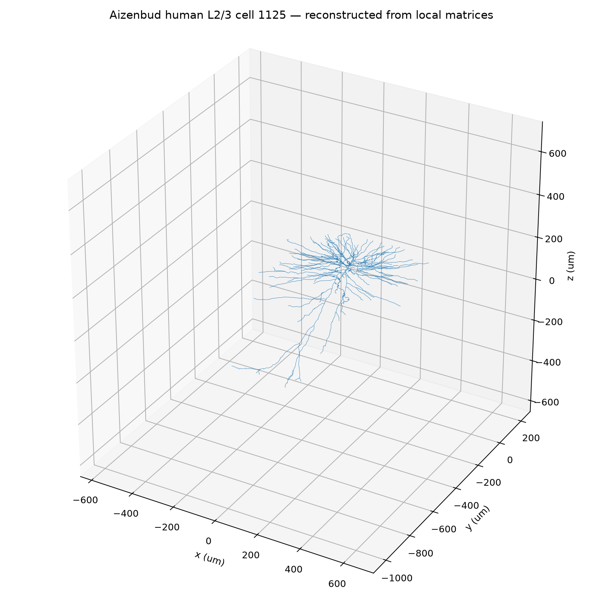

# Operaattori

> **This repo changed direction substantially midway through.** Gates 0–9 are
> the original synthetic "grown operator" investigation. From Gate 10 onward,
> the project pivots to the scaffolding idea: take a real reconstructed human
> neuron (cell 1125, shown above), make its geometry and cable physics explicit
> as operators, and then ask which parts of the biological scaffold actually
> buy function under hard ablations. The earlier gates are kept as provenance,
> not presented as one seamless final model.

**Operaattori** is Finnish for **operator**.

This repo asks one deliberately narrow question:

> **Can identical initially matched substrates convert the temporal order of a
> signal into persistent grown anatomy, after all labile state has washed out,
> and does that anatomy causally become a different future operator?**

The headline experiment is the one a wet neural culture cannot easily give us:
**identical-clone order tests with complete internal observability**.

This is not an organoid simulator, a biological-neuron model, or an
intelligence claim. The first object is much smaller:

~~~text
signal history
     ↓
fast excitable state
     ↓
local transport / eligibility
     ↓
slow hysteretic material
     ↓
material changes later transport
     ↓
grown operator
~~~

The matrix is present from commit one. It is the ruler, not the enemy.

## The protocol is designed against the obvious cheat

The primary histories are:

~~~text
H0 = A A A B B B
H1 = A B B A A B
~~~

They have:

- exactly the same number of A and B blocks;
- the same **first** block;
- the same **last** block;
- the same total drive;
- the exact same long suffix after the histories differ;
- a silence interval longer than seven eligibility time constants.

So a decoder cannot win merely by reading "what happened last."

The canonical decoder is deliberately stupid: leave-one-clone-pair-out
**nearest centroid** on the final morphology. A second readout normalizes every
anatomy to unit total mass first, so total material amount cannot be the only
answer.

## The multistability null is load-bearing

Hysteresis is necessary to escape ordinary contraction, but it can also latch
its own noise. Therefore every order result is compared with repeated runs of
the **same history** under independently resampled microscopic noise.

The order effect must clear that within-history multistability floor.

## The rulers

Two same-capacity abstract controls are always reported:

1. **ContractiveMatrixRuler** — 32 stable linear state variables with the same
   two input channels and the same washout. It is allowed to remember only
   through ordinary decaying state.
2. **BistableStateRuler** — 32 abstract hysteretic state variables. This is the
   dangerous null: if hysteresis alone stores the sequence, it should pass.

If the bistable abstract state passes, that is not a failure of the assay. It
prevents the repo from claiming that morphological memory is a computational
function unavailable to ordinary abstract state.

## Gate ladder

### Gate 0 — protocol + ruler

Audit the order protocol before trusting any anatomy. Run both matrix/state
rulers.

### Gate 1 — signal → morphology

After identical suffix + long silence:

- fast state must be gone;
- labile eligibility must be gone;
- raw anatomy must decode history;
- **mass-normalized anatomy** must still decode history.

This earns morphological memory, not learning or intelligence.

### Gate 2 — multistability noise floor

Repeat each history with independently resampled noise and initial
micro-heterogeneity. The between-history effect must exceed the latch's own
within-history spread. A same-history pseudo-classification must stay near
chance.

### Gate 3 — anatomy → operator

Freeze anatomy, reset every fast variable, and apply the same standardized
probe pulses.

The two histories are pairwise mass-matched before probing. If their responses
still differ, spatial arrangement is causal.

For this first substrate the frozen fast dynamics are deliberately linear, so
the repo also derives the exact matrix

~~~text
u(t+1) = A[m] u(t) + B s(t)
~~~

from the grown anatomy and verifies that matrix replay matches the spatial
simulation numerically.

That is the point of the name:

> **the anatomy is a self-grown operator.**

It does **not** yet beat a matrix. When frozen, it *is exactly representable as
one*.

### Gate 4 — delayed consequence stabilizes a useful operator

Gates 1–3 survived, so Gate 4 is now implemented.

A continuous strip receives balanced A/B trials. The soma-like readout has a
deliberately simple target: become more responsive to A than B. The scalar
target error arrives only after a silent delay; it can act only on the
currently lingering local eligibility field.

Attackers:

- causal delayed consequence;
- same-magnitude consequence with randomized sign;
- correct consequence applied to spatially shuffled eligibility;
- no consequence.

This task is intentionally trivial for an explicit two-weight digital model.
Gate 4 therefore tests **local delayed structural credit**, not computational
superiority.

### Gate 5 — the matrix itself is state

Gate 5 is now the explicit **moving-matrix** experiment.

The minimal operator is:

~~~text
h(t+1) = A(t) h(t) + (I - A(t)) 1 x(t)
y_hat  = w(t)^T h(t)

A(t) = diag(lambda_1(t), lambda_2(t))
logit(lambda) = base + fast(t) + slow(t)
~~~

The recurrent eigenvalues are no longer fixed parameters. They are dynamical
state updated online through a local sensitivity/eligibility trace.

The benchmark is deliberately two-sided:

1. a smoothly drifting two-timescale memory-kernel world, where a moving
   operator should be a natural compact representation;
2. an exact drifting-delay world, where explicit addressable context should
   beat that compression.

The transformer-like ruler is a causal explicit-token lag-attention system.
A strong explicit-context LMS ruler is present as well.

Do not build a bug, animal, population, genome, reproduction loop, or
"intelligence" layer before this mathematics has clear boundaries.

## Why this exists

The direct ancestry is spread across earlier repos:

- [FunctionalArbors](https://github.com/anttiluode/FunctionalArbors) — free
  branching material could grow task-relevant geometric delay; later gates
  exposed credit assignment as the hard part.
- [Sunday](https://github.com/anttiluode/Sunday) — history can persist in
  distributed substrate state under a material budget; reservoir attackers
  demoted the broad computing claim.
- [GeoNeuronX](https://github.com/anttiluode/GeoNeuronX) — dendritic dynamics
  materialize temporal history into simultaneous branch state; local
  nonlinearities act before soma collapse.
- [yrotisopeRweN](https://github.com/anttiluode/yrotisopeRweN) and
  [T-800NNP](https://github.com/anttiluode/T-800NNP) — continuously running
  state, stable local addresses, delayed eligibility and finite structural
  allocation.
- [DifferentMachine](https://github.com/anttiluode/DifferentMachine) —
  inherited developmental rule is distinct from acquired structural
  phenotype.
- [BlackBoxLab](https://github.com/anttiluode/BlackBoxLab) Datarium 5 —
  activity writes slow oriented internal material and that material changes
  later field geometry.

Operaattori is an attempt to put the smallest surviving pieces into one
controlled object rather than adding another life simulation around them.

## Run

~~~bash
python -m pip install -r requirements.txt

python experiments/gate0_protocol_and_rulers.py
python experiments/gate1_order_memory.py
python experiments/gate2_multistability_null.py
python experiments/gate3_grown_operator.py
python experiments/gate4_delayed_consequence.py
python experiments/gate5_moving_operator.py
python experiments/gate6_rich_operator.py
python experiments/gate7_rotating_basis.py
python experiments/gate8_meta_law.py
python experiments/gate9_lie_path.py

python -m unittest discover -s tests -v
~~~

Machine-readable receipts are written under `results/`.

## First receipt — Gates 0–4 survive the initial implementation

The first 24-clone / 12-clone battery gives:

| measurement | result |
|---|---:|
| contractive matrix order decoder | **0.500** |
| bistable abstract-state order decoder | **1.000** |
| raw morphology order decoder | **1.000** |
| **unit-total-mass morphology** order decoder | **1.000** |
| fast-state residual after washout | **2.43e-7** |
| eligibility residual after washout | **2.04e-3** |
| order-shape distance / same-history multistability floor | **125.67×** |
| same-history pseudo-class decoder | **0.417** |
| mass-matched future-response order distance | **1.028 relative L2** |
| response order effect / same-history response floor | **23.26×** |
| mass-matched frozen-operator matrix distance | **0.0178 relative L2** |
| exact spatial-vs-matrix replay error | **1.05e-17** |
| Gate-4 causal selectivity | **+0.481 ± 0.115** |
| Gate-4 shuffled-consequence selectivity | **-0.226 ± 0.397** |
| Gate-4 shuffled-eligibility selectivity | **-0.210 ± 0.266** |
| Gate-4 no-credit selectivity | **-0.390 ± 0.055** |

This is a useful combination of positive and negative results.

**Positive:** order survives as spatial morphology after the labile state is
gone, survives total-mass normalization, clears the hysteresis/noise floor, and
changes later standardized propagation after pairwise total-mass matching.

**Negative / ruler:** a same-capacity abstract bistable state also stores the
order perfectly. And once the morphology is frozen, the spatial probe is
exactly reproducible by the derived linear matrix. Operaattori has therefore
earned **self-grown operator**, not a new function class and not superiority to
matrices.

**Gate 4:** delayed scalar consequence changes the final operator only when it
remains causally paired with the correct local eligibility address. Randomizing
the consequence sign or shuffling the eligibility address destroys the
selective effect. The task itself is still trivial for an explicit digital
two-weight solution.

Detailed receipts: [Gate 0](results/GATE0.md),
[Gate 1](results/GATE1.md), [Gate 2](results/GATE2.md),
[Gate 3](results/GATE3.md), [Gate 4](results/GATE4.md),
[Gate 5](results/GATE5.md), [Gate 6](results/GATE6.md),
[Gate 7](results/GATE7.md), [Gate 8](results/GATE8.md),
[Gate 9](results/GATE9.md), [Gate 10](results/GATE10.md),
[Gate 11](results/GATE11.md), [Gate 12](results/GATE12.md),
[Gate 13](results/GATE13.md), and [Gate 14](results/GATE14.md).

## Gate 5 first receipt — moving matrix, with the killer beside it

Across eight seeds in the smoothly drifting hidden memory-kernel world:

| model | MSE |
|---|---:|
| **moving two-mode operator** | **5.46e-05 ± 3.27e-06** |
| frozen same-state operator | 1.70e-04 ± 6.76e-06 |
| 64-token explicit-context LMS | 6.17e-05 ± 3.25e-06 |

The moving operator's observer-measured temporal scale follows the hidden
world:

~~~text
corr(operator effective tau, teacher effective tau)
= 0.9921 ± 0.0012
~~~

The moving system keeps **10** mutable/stored online scalars. The 64-token
context ruler keeps **128**.

But the exact-delay attacker kills the universal claim:

| model | drifting exact-delay MSE |
|---|---:|
| moving two-mode operator | 1.087 ± 0.015 |
| frozen same-state operator | 0.997 ± 0.010 |
| 32-token explicit-context LMS | 0.253 ± 0.0065 |
| **32-token causal lag attention** | **0.0957 ± 0.0035** |

~~~text
corr(moving effective tau, true lag)   = -0.062 ± 0.131
corr(attention estimated lag, true lag)=  0.9953 ± 0.0018
~~~

So Gate 5 earns exactly one new sentence:

> **Past can sometimes be compressed into a moving present operator very
> efficiently, but exact addressable history is not one of those cases.**

That is already the first mathematical boundary for the Transformer question.
A serious alternative now has to learn what should become operator state and
what must remain explicitly addressable.

## Gate 6 — richer hidden operator, same question

Gate 6 removes Gate 5's exact two-mode teacher/student match. The hidden world
now has **six independently drifting exponential memory modes** and drifting
mixture weights.

The best result is a four-mode moving operator:

| model | online scalars | MSE |
|---|---:|---:|
| moving-2 | 10 | 3.218e-4 |
| frozen-2 | 10 | 1.876e-3 |
| **moving-4** | **20** | **3.503e-5** |
| frozen-4 | 20 | 5.189e-5 |
| moving-8 | 40 | 3.879e-5 |
| context-128 | 256 | 1.942e-4 |
| RLS-64 | 4,224 | 3.959e-4 |

The moving-4 operator remains on the online-state budget/error frontier even
against a full-covariance RLS attacker. Its effective temporal horizon tracks
the hidden world's moving horizon with correlation **0.860**.

The negative result is useful too: eight moving modes are slightly worse than
four. Capacity and adaptation speed trade off.

See [Gate 6](results/GATE6.md).

## Gate 7 — the operator basis moves too

Gate 7 uses a hidden two-state teacher

~~~text
A(t) = R(phi(t)) diag(lambda_1(t), lambda_2(t)) R(phi(t))^T
~~~

so both timescales and eigenvectors drift.

The first update rule failed its preregistered basis-alignment threshold even
though prediction improved. That failure is preserved in the kill ledger.

Replacing independent coordinate normalization with the coupled local
sensitivity solve

~~~text
(P^T P + 0.02 I) delta = P^T error
~~~

passes the **same** thresholds:

| model | online scalars | MSE | operator error | basis alignment |
|---|---:|---:|---:|---:|
| **moving full basis** | **14** | **0.004382** | **0.0239** | **0.671** |
| moving diagonal | 10 | 0.012389 | 0.0626 | — |
| frozen full | 14 | 0.024586 | — | — |
| context-32 | 192 | 0.002315 | — | — |
| RLS-32 | 4,288 | 0.001826 | — | — |

So the matrix is now genuinely moving in more than one sense: its spectrum and
its basis both adapt online. Explicit context still wins absolute error when
given much more online state.

See [Gate 7](results/GATE7.md).

## Gate 8 — the law that moves the operator generalizes

Gate 8 selects one small developmental law on eight training worlds, freezes
that law, resets the operator, and drops it into eight unseen worlds.

The selected rule ranked **1 / 40** on the held-out worlds:

| measurement | result |
|---|---:|
| selected held-out MSE | **1.632e-05 ± 8.9e-06** |
| hand-written Gate-6 rule | 3.015e-05 |
| frozen operator | 3.785e-05 |
| median candidate rule | 3.788e-05 |
| cheating per-world oracle | 1.609e-05 |
| selected / oracle | **1.014×** |
| held-out horizon correlation | **0.717** |

Every held-out world begins from the same `A(0)`; what transfers is the update
law, not the developed matrix.

See [Gate 8](results/GATE8.md).

## Gate 9 — history becomes geometry in operator space

The matrix-exponential observation suggested a stricter test of the moving
operator itself.

Two primitive shear generators are supplied:

~~~text
H = [[0,1],      V = [[0,0],
     [0,0]]           [1,0]]
~~~

Their commutator is a saddle:

~~~text
[H,V] = [[ 1, 0],
         [ 0,-1]]
~~~

Now run a closed operator loop:

~~~text
H -> V -> -H -> -V
~~~

The integrated generator is exactly zero. An order-blind
`exp(integral A dt)` approximation therefore predicts identity.

It is wrong:

| measurement | result |
|---|---:|
| net generator exposure | **0** |
| noncommuting loop residue | **0.0091088** |
| commuting-control residue | **3.14e-16** |
| reverse-loop / commutator alignment | **0.996835** |
| residue scaling exponent | **2.0029** |

The epsilon-squared scaling is the BCH/Lie-bracket signature.

A two-feature observer trained on path lengths 8/12/16 and tested only on
unseen lengths 10/14/18 reads signed path area from the final state with
**0.9717 correlation** and **0.9130 R²**. The commuting control is at zero
(`R² = -0.0006`).

The closure audit is the more important architectural result:

~~~text
2x2 shear primitives:                 2 -> 3 dimensions, then saturation

3-state nearest-neighbor shears:
1 <-> 2 <-> 3

primitive span:                       4 dimensions
Lie closure:                          8 dimensions = full sl(3)
~~~

The non-neighbor `E13` direction is absent from the primitive span but appears
in the closure.

This is not a new function class relative to a full adaptive matrix, and a tiny
digital counter solves the toy signed-loop task exactly. What Gate 9 earns is a
mechanism:

> **ordered local operator motion can create effective directions and retain
> history that are absent from the instantaneous operator and its time-average.**

See [Gate 9](results/GATE9.md).

## Gate 10 — the matrix scaffold is put on a real human neuron

Gate 10 moves from toy operator graphs to the exact human L2/3 exemplar used in
Aizenbud et al. (2026): morphology **1125**,
`2013_03_06_cell11_1125_H41_06.asc`, reported FCI **0.4294**.

The source is pinned to the authors' public FCI repository commit. Every
neurite point is represented by a parent-local rigid 4x4 transform. Absolute
neurite coordinates are then discarded and the arbor is rebuilt only by

~~~text
W_child = W_parent L_child
~~~

At a bifurcation, one parent frame produces multiple child frames: the matrix
scaffold literally forks with the dendritic tree.

The gate also changes only one internal local rotation. Its attachment point
must remain fixed, all non-descendants must remain fixed, its entire distal
subtree must move coherently, and all cable lengths must remain unchanged.

This gate earns only **geometry-as-scaffold**. It does not yet make the neuron
learn or grow.

See [Gate 10](results/GATE10.md).

## Gate 11 — real dendritic transport has path order

Gate 11 attaches classical passive-cable two-port matrices to the real
cell-1125 dendritic paths, using the Aizenbud passive parameters rather than an
invented neural operator.

Across 64 long dendritic paths:

| measurement | result |
|---|---:|
| median path length | **357.6 um** |
| median point segments/path | **241** |
| raw adjacent-point commutator | 3.712e-17 |
| **25-um block commutator** | **6.754e-04** |
| uniform-radius block commutator max | 2.127e-16 |
| real vs reversed impedance | **0.315524** |
| real vs shuffled impedance | **0.174423** |
| real vs reversed gain | **0.315524** |
| median phase difference | **0.237898 rad** |
| median group-delay difference | **1.52477 ms** |
| area-matched uniform-radius reverse control | **1.039e-14** |

The first version of this gate failed its microscopic commutator meter even
while the reversal/shuffle effects were large. That failure is preserved in the
receipt. The ASC reconstruction is sampled at roughly micron scale, where the
two-piece commutator is second-order tiny. Grouping contiguous pieces into
25-um cable blocks reveals the finite-scale noncommutativity without changing
the functional gate or attacker.

So Gate 11 earns:

> **the spatial ordering of heterogeneous local passive transport operators is
> a real functional degree of freedom on the reconstructed human dendrite.**

It does not earn learning or intelligence. See [Gate 11](results/GATE11.md).

## Gate 12 — attack the biological ordering itself

Gate 11 proves that order matters. Gate 12 asks whether the **real** order is
unusual or whether gross taper and endpoint placement explain most of the
effect.

The exact same segment multiset is challenged by:

- full random permutations;
- ideal thick-to-thin and thin-to-thick taper rulers;
- endpoint-preserving shuffles;
- 10/25/50/100-um within-window shuffles that preserve the coarse
  proximal-to-distal profile while destroying progressively larger-scale
  internal order.

The output is an empirical tail position of the biological transfer signature.
No task utility is assigned, so "unusual" is not called "better" or
"optimized." A negative scientific result is allowed to pass CI.

See [Gate 12](results/GATE12.md).

## Gate 12 receipt — ordinary taper explains the path order

The first Gate-12 audit initially looked spectacular under randomization: every
tested path landed in the tail of the full and constrained shuffle nulls.

Then the boring deterministic attacker won.

~~~text
median radius-increase steps          0
median nonincreasing fraction         1.000000
paths exactly stable thick->thin      0.938

real -> thick-to-thin distance        0.000 null-SD RMS
real -> thin-to-thick distance       23.951 null-SD RMS
~~~

The correct classification is:

~~~text
MONOTONIC_TAPER_EXPLAINS_REAL_ORDER
~~~

So Gate 11's large reversal/shuffle effects are genuine cable physics, but they
do **not** establish an additional fine-grained biological operator sequence.
The null shuffles mostly destroy ordinary proximal-to-distal taper.

See [Gate 12](results/GATE12.md).

## Gate 13 — branch junctions become operators

Gate 13 puts the complete passive dendritic tree into the algebra rather than
treating each root-to-tip cable as isolated.

Two independent calculations agree:

1. exact whole-tree Schur elimination;
2. the selected tapering path with every off-path subtree replaced by its exact
   shunt admittance matrix.

~~~text
dendritic tips                       110
median branch junctions/path         5.0
tree/shunt-product max error         4.558e-11

FULL vs same isolated path           0.2676 median relative difference
median |gain change|                 1.712 dB
median phase change                  0.1660 rad
tips median effect >10%              0.864
branch-count/effect correlation      0.958
~~~

So bifurcations are not decorative. Side branches materially change the
transfer along an otherwise identical tapering route.

But the passive portfolio remains nearly rank one:

~~~text
effective rank FULL tree             1.030
effective rank isolated paths        1.024
~~~

That negative result matters. Passive branch loading changes signals strongly,
but does not by itself manufacture a rich repertoire of distinct computations.

See [Gate 13](results/GATE13.md).

## Gate 14 — NMDA adds gain, not a new dimension

Gate 14 closes selected real branches through the Aizenbud/released-code NMDA
voltage gate while keeping the exact passive tree as the surrounding linear
operator.

~~~text
human / frozen-block at 48 synapses     1.1122 median
branches above +10%                     0.800

human cooperativity                     0.1871
frozen-block cooperativity              0.1730

dose-response rank HUMAN                1.070
dose-response rank FROZEN               1.051
rank gain                               0.020

coarse branch-scalar attacker R²        0.586
~~~

So voltage-dependent NMDA gives a real but modest nonlinear boost. It does not,
in this reduced quasi-static assay, create the large repertoire jump we were
looking for.

See [Gate 14](results/GATE14.md).

## Gate 15 — electrical locality survives; the NMDA-locality hypothesis does not

Gate 15 matched same-branch inputs against inputs on different branches using
their individual passive driving-point impedance and soma transfer.

The first version spread the "cluster" over whole 293–385-um unbranched runs.
It was negative. We therefore tightened the definition rather than accepting an
easy kill: eight sites were restricted to compact 39–49-um windows and matched
again to sites on six to eight other branch runs.

~~~text
compact Gate 15b

median passive Rinput match             1.059x
median passive soma-transfer match      1.080x
cluster/dispersed Green coupling        9.557x

NMDA-specific locality:
  soma current H/F                      0.9241
  local voltage H/F                     0.9196
  max local voltage H/F                 0.9652

branches >1.05                          0 / 8

median local voltage, 48 synapses:
  compact HUMAN / FROZEN               -2.61 / -5.43 mV
  dispersed HUMAN / FROZEN            -11.14 / -17.93 mV
~~~

So compact branch sites are very clearly an **electrically interacting
compartment**. But in this quasi-static model they do not selectively amplify
the human NMDA voltage dependence. They are already driven close to the
excitatory reversal potential with the Mg block frozen, and the relative NMDA
advantage is actually smaller than in the dispersed matched control.

The correct result is therefore narrower than "branches are not compartments":

~~~text
NO_ROBUST_NMDA_LOCALITY_ADVANTAGE
~~~

See [Gate 15](results/GATE15.md).

## Gate 16 — the real kinetic model reverses the quasi-static result

Gate 15's equilibrium reduction was negative. The same compact/dispersed test
in the authors' pinned released NEURON model is not.

~~~text
median compact span                    41.92 um
passive Rinput match                   1.037x
passive soma-transfer match            1.126x

48-synapse local-AUC locality          1.5143
branches >1.05                         5 / 6
somatic spikes                         0 / 6
~~~

So the missing ingredient was temporal synaptic dynamics: with the released
0.3/1.8-ms AMPA and 5/43-ms NMDA kinetics, compact coactivation gains a
HUMAN/FROZEN interaction advantage that the quasi-static model erased.

See [Gate 16](results/GATE16.md).

## Gate 17 — the effect survives each set's own time-domain null

For every exact three-site set, Gate 17 compares simultaneous activation with
the sum of the same three sites activated individually. That independent sum
already contains the set's own input resistance, cable filtering and temporal
response.

~~~text
compact HUMAN/FROZEN interaction       2.6265x
dispersed HUMAN/FROZEN interaction     1.3818x
interaction locality                   1.6759
branches >1.05                         4 / 6
~~~

Two branches are essentially null, so this is heterogeneous. But ordinary
differences in each set's passive time filtering do not explain the median
effect.

See [Gate 17](results/GATE17.md).

## Gate 18 — the paper's Hybrid B attacker survives too, but the hard pass is narrow

The paper/released-code Hybrid B changes only NMDA gamma from the human
0.078/mV to the smaller rat 0.062/mV while retaining human kinetics and raw
conductances.

~~~text
HUMAN / paper Hybrid-B locality        1.6439
branches >1.05                         5 / 6
~~~

A harder attacker then rescales every gamma=0.062 synapse so its effective NMDA
conductance at that site's actual resting voltage is exactly equal to HUMAN.
That removes the resting-strength difference and leaves the voltage-dependence
curve as the intended contrast.

~~~text
median gamma062 raw-ratio scale        0.3337x human
rest-matched locality                  1.0592
branches >1.05                         3 / 6
~~~

So this is a **narrow pass**, not a claim that human gamma dominates every
branch. What survives is that the human NMDA voltage-dependence shape
contributes to compact interaction beyond resting effective NMDA strength.

See [Gate 18](results/GATE18.md).

## Gate 19 — compact coactivation is not a simple sequence detector

Gate 19 kept the same three compact sites and the same total input, but staggered
the events by 4 ms and reversed proximal-to-distal versus distal-to-proximal
order. Every order was divided by its own time-shifted sum-of-single-sites
prediction.

~~~text
HUMAN compact order magnitude          0.0005
HUMAN dispersed order magnitude        0.0089
compact branches with >5% order effect 0 / 6
compact-dispersed excess log          -0.0080
gamma-specific excess log             -0.0088
~~~

So the Gates 16–18 effect should not be sold as a local sequence processor.
At this preregistered lag the compact branch behaves much more like a nonlinear
coactivation compartment than something that cares which end was stimulated
first.

See [Gate 19](results/GATE19.md).

## Gate 20 — the scaffold decomposes into nonlinear branch subunits

Gate 20 passed in the pinned released cell-1125 model.

~~~text
HUMAN within-branch nonlinearity       70.19% median
extra cross-branch interaction          2.01% median
modularity margin (log)                 0.4582
positive margin                        14 / 15 pairs
somatic spike guard                     0 / 15

rest-matched gamma=.062 margin          0.0579
HUMAN extra gamma-specific margin       0.3971
~~~

The important null is hierarchical: a cross-branch pair is compared with the
sum of its **two complete branch-alone responses**, so all nonlinearity already
occurring inside either branch is present in the null. The remaining
cross-branch interaction is small relative to the within-branch interaction.

Classification:

~~~text
HUMAN_GAMMA_STRENGTHENS_SEMI_INDEPENDENT_COMPARTMENTS
~~~

See [Gate 20](results/GATE20.md).

## Gate 21 — equal-budget redistribution across the branch basis

Gate 21 is the first explicit computation/usefulness attack on the compartment
picture.

For every pair of the same six measured compact branches, keep the same six
physical sites active and keep the global budget fixed at 48 virtual synapses.
Only redistribute that budget between the two branch compartments:

~~~text
12 + 36 synapses
24 + 24 synapses
36 + 12 synapses
~~~

The actual soma trace is challenged by three rulers:

1. **total-input ruler** — all three redistributions are identical because the
   total input is identical;
2. **independent-site ruler** — sum the six matching single-site responses,
   preserving branch identity and passive transfer but removing within-branch
   interaction;
3. **nonlinear-subunit ruler** — sum the two measured branch-alone responses at
   the exact two doses, preserving within-branch nonlinearity but assuming the
   branches combine independently.

The key metric is the centered log-AUC signature across the three
redistributions for each fixed branch pair. If the nonlinear-subunit ruler
predicts those equal-budget signatures substantially better than the
independent-site ruler, the branch decomposition has bought a compact
factorization of an input-output function rather than merely a descriptive
anatomical label.

## Gate 21 receipt — allocation matters, clean waveform factorization fails

With the same two branches, same six sites and same total 48 virtual synapses,
redistributing the budget changes the somatic response strongly:

~~~text
HUMAN equal-budget AUC range           1.3414x median
pairs with range >=1.05               15 / 15

centered AUC-signature RMSE
  total-input                          0.1323
  independent sites                    0.1336
  nonlinear branch basis               0.0402

branch vs site signature advantage      3.320x
~~~

So the scalar total-input ruler is dead, and the measured nonlinear branch
basis predicts **which redistribution wins** much better than independent
sites.

But the preregistered gate also required the complete soma waveform to
factorize. It did not:

~~~text
nonlinear-branch full-trace NRMSE       0.1994
required                               <=0.10
~~~

Classification:

~~~text
NO_CLEAN_BRANCH_SUBUNIT_FACTORISATION
~~~

We do not scan doses to rescue it. See [Gate 21](results/GATE21.md).

## Gate 22 — separate 3-D embedding from intrinsic cable geometry

The next test returns to the matrix scaffold itself.

Gate 10 can bend a large distal subtree by rotating one local SE(3) frame while
preserving every cable length. Gate 22 asks whether that visually dramatic
change is electrically causal **by itself**.

It compares the original cell-1125 scaffold with:

- a locked 35-degree isometric local bend;
- a 20% stretch of the intrinsic cable metric on the same subtree.

The classical cable equation should ignore the first and respond to the
second. If so, that is an important constraint on the geometric-neuron idea:
XYZ shape only becomes computational when it couples to an external spatial
field, synapse placement, mechanics, diffusion or another genuinely
embedding-dependent process.

See [Gate 22 protocol](results/GATE22.md).

## Current stopping line

> **Do not call every visible matrix bend a new electrical operator. First
> separate extrinsic 3-D embedding from intrinsic length/radius/topology. If
> Gate 22 confirms the expected invariance, the next route is to give the real
> arbor a fixed spatial environment and test whether bending the scaffold
> changes what it samples.**

